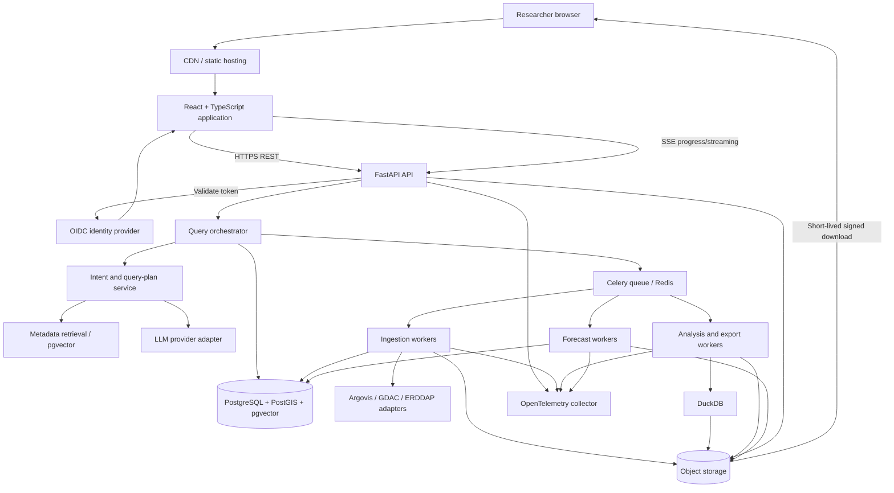

# FloatChat Production System

## Architecture, Technology Decisions, Final Product, and Staged Delivery Plan (v2)

**Document audience:** Founder, CTO, engineering leadership, data engineering, ML engineering, DevOps, and scientific stakeholders  
**Document status:** v2. Target production architecture plus a staged delivery plan. "Post-Phase-6" in older wording means the system after Stage 8 (§29). Read §0 first.  
**Frontend:** React; Streamlit is not part of the production system  
**Backend:** FastAPI; Django is not part of the production system  

---

## 0. Revision 2 — read this first

This revision keeps the architecture in §1–§28 and changes how it is delivered. Where this section conflicts with a later section, this section wins.

| # | Change | Where | Why |
|---|---|---|---|
| 1 | The undefined "six phases" are replaced by nine build stages (0–8), each with exit criteria | §29 | A builder (human or agent) needs explicit gates |
| 2 | New evaluation and research plan: golden NL benchmark, ablations, forecast backtests, reproducible reports | §30 | Makes FloatChat a measurable research artefact; every published number must come from a committed evaluation run |
| 3 | v1 deployment profile: one Linux VM running Docker Compose, static frontend on a CDN, S3-compatible object storage, staging and production | §19.5 | Fits a student budget; the same images move to managed services later without code changes |
| 4 | v1 scope cuts: custom-analysis sandbox, NetCDF export, BGC parameters, `power_researcher`/`data_curator` roles, multi-region deployment | §29.10 | Ship the core end to end first |
| 5 | Authentication uses a managed OIDC provider's free tier (e.g. Auth0, Clerk or a self-hosted Keycloak); v1 roles are `researcher` and `administrator` | §15 | No password storage, minimal ops |
| 6 | LLM default is Gemini behind the provider adapter; the embedding model is pinned and recorded; a daily LLM spend cap is enforced | §5.11, §10.5 | Cost control and reproducibility |
| 7 | Secret remediation is Stage 0 work: every key found in prototype history is revoked, history is rewritten, gitleaks runs in pre-commit and CI | §16.1 | Real keys exist in the prototype's public history |
| 8 | Data licensing and attribution requirements added | §3.2 | Argo and Argovis require citation |
| 9 | Repository layout and engineering conventions added | §31 | Consistent structure across stages |
| 10 | v1 recovery point objective is 24 hours (nightly backups) instead of 15 minutes | §19.5 | Single-VM profile; tighten when moving to managed PostgreSQL |

---

## 1. Executive summary

FloatChat is a production web platform for discovering, retrieving, analysing, visualising, forecasting, and exporting Argo ocean-profile data through both a conventional dashboard and a natural-language assistant.

The system solves two different but connected problems:

1. Researchers need a responsive interface for exploring recent Argo data without learning NetCDF, SQL, geospatial query syntax, or Python.
2. Researchers occasionally need much larger historical datasets that are not already held in FloatChat's recent-data store. Those requests must be fetched from an upstream Argo source, normalised, cached, analysed, and exported without making the browser wait for a long-running HTTP request.

FloatChat therefore uses a tiered data architecture:

- The latest 12 months of normalised observations are available in PostgreSQL/PostGIS for interactive dashboard and geospatial queries.
- The latest three months are maintained as an optimised Parquet hot tier for fast columnar analysis.
- Older, uncached periods are retrieved on demand from Argovis or another configured Argo source by asynchronous workers.
- Retrieved historical data is converted into partitioned Parquet and registered in a coverage catalogue before it is queried.
- Semantic metadata—not millions of numeric observations—is embedded in pgvector so the language model understands the schema, parameter meanings, geographic aliases, query examples, and data-quality rules.

The language model is not allowed to execute arbitrary code in the API process. It converts a natural-language request into a constrained, schema-validated query plan. Deterministic application code then compiles that plan into parameterised PostgreSQL/PostGIS SQL, a DuckDB query over Parquet, an approved chart specification, a forecast request, or an export job.

The final result is not simply a chatbot. It is a complete data product consisting of:

- A React web application
- A documented FastAPI API
- An ingestion and background-processing platform
- A recent-data relational and geospatial store
- A partitioned Parquet analytical tier
- A semantic metadata and RAG subsystem
- Safe query and visualisation engines
- A versioned forecasting subsystem
- Downloadable research datasets
- Authentication, quotas, audit records, monitoring, backups, tests, and operational runbooks

---

## 2. What the completed product looks like

After signing in, a researcher sees four primary product areas.

### 2.1 Data dashboard

The dashboard presents the most recent available Argo data and makes its coverage explicit. It includes:

- Map of active floats and profile locations
- Date, region, parameter, depth, QC, float, and mission filters
- Float trajectories
- Temperature-versus-depth and salinity-versus-depth profiles
- Temperature-salinity diagrams
- Time-series charts
- Correlation and distribution views
- Data availability and missingness summaries
- Core-Argo versus BGC-Argo coverage
- Source timestamp and FloatChat ingestion timestamp
- Export action for the currently filtered dataset

The initial tested dataset is January 2025 Indian Ocean data. Production is designed around a rolling 12-month PostgreSQL window and a rolling three-month Parquet hot tier.

### 2.2 Conversational research interface

The user can ask questions such as:

- “Show monthly mean salinity in the Arabian Sea for the last six months between 0 and 100 dbar.”
- “Find the closest profiles to 10°N, 70°E in March 2025.”
- “Compare temperature profiles for these two floats.”
- “Create a temperature-salinity diagram and explain the visible relationship.”
- “Prepare the previous ten years of temperature and salinity observations in Parquet.”
- “Forecast monthly regional salinity for the next three months and show confidence intervals.”

FloatChat responds with a structured result: an answer, table, map, chart, dataset job, forecast, or a clarification if an essential constraint is missing. Each scientific result exposes provenance, coverage, units, QC selection, transformations, and any limitations.

### 2.3 Job and export centre

Long-running historical requests are represented as durable jobs. The user can:

- See queued, fetching, validating, converting, analysing, exporting, completed, partially completed, cancelled, and failed states
- View progress by time partition or upstream request chunk
- Resume an interrupted request without downloading completed chunks again
- Download CSV, Parquet, or supported NetCDF output
- See file size, row count, checksum, creation time, expiry time, and source citation
- Re-run a previous query against refreshed data

### 2.4 Forecast workspace

The forecast workspace does not claim to be an ocean circulation model. It provides transparent statistical forecasts for well-defined, regularly sampled derived series, such as monthly mean salinity within a region and depth band.

It shows:

- Training period and aggregation definition
- Missing-data treatment
- Baseline and selected model
- Backtest metrics
- Prediction and confidence intervals
- Model version and generation time
- Warnings when the history is too short, too sparse, or structurally unsuitable

---

## 3. Scope and explicit assumptions

This reference architecture assumes:

- “ArgoWest” in informal project discussion refers to Argovis unless a separate proprietary source is later identified.
- Argovis is the primary on-demand source at launch.
- A source-adapter interface permits GDAC, ERDDAP, argopy, or an internally maintained client to be added without changing the query or storage layers.
- Core physical variables initially include pressure, temperature, and practical salinity.
- BGC variables are supported through a flexible observation representation because available variables vary by mission and float.
- User authentication is delegated to a standards-compliant identity provider using OpenID Connect; FloatChat does not implement password storage.
- The production deployment uses managed services where practical but remains portable across AWS, Azure, GCP, or an institutional data centre.
- The platform is a research-data access and analysis product, not a safety-critical navigation or operational ocean-warning system.
- Default synchronous API responses are bounded. Large historical retrieval and export work is asynchronous.

### 3.1 Initial production service objectives

These are engineering targets, not guarantees until measured in staging and production:

| Capability | Initial objective |
|---|---:|
| Monthly interactive-service availability | 99.9% |
| Metadata/API p95 latency | under 2 seconds |
| Cached aggregate-query p95 latency | under 5 seconds |
| Background-job acknowledgement | under 1 second |
| Scheduled recent-data freshness | within 24 hours of upstream availability |
| Synchronous result limit | 50,000 rows, configurable |
| Large export | asynchronous, configurable size/quota limit |
| PostgreSQL recovery point objective | 15 minutes or better with managed point-in-time recovery |
| Service recovery time objective | 4 hours for the initial production tier |

Historical retrieval completion time is not assigned a fixed latency target because it depends on date range, area, variables, upstream performance, rate limits, and upstream availability. FloatChat instead guarantees durable progress visibility, retry, and resumability.

### 3.2 Data licensing and attribution

- Cite the Argo data set in the application footer, every export manifest, the README and the technical report, using the citation text and DOI published by the Argo programme (Argo GDAC data set, SEANOE DOI 10.17882/42182; verify the current wording on the Argo website).
- Acknowledge Argovis as the access service and cite its reference publication, following the Argovis terms of use.
- Respect upstream rate limits and terms; record source and retrieval time in provenance (§17).

---

## 4. System architecture



### 4.1 Architectural principle: synchronous control, asynchronous data work

FastAPI performs lightweight control-plane work:

- Authentication and authorisation
- Input validation
- Query-plan creation and validation
- Coverage lookup
- Fast bounded database queries
- Job creation
- Status and result delivery

Workers perform data-plane work:

- Large upstream downloads
- Multi-part historical retrieval
- Data normalisation and quality validation
- Parquet writes
- Large DuckDB scans and joins
- Dataset exports
- Model training and forecasts
- Optional sandboxed custom analysis

This split prevents one ten-year request from occupying an API worker, exceeding a reverse-proxy timeout, exhausting API memory, or degrading every interactive user.

### 4.2 Architectural principle: the coverage catalogue decides where data comes from

The query engine does not guess that data is cached because a similarly named file exists. It asks a coverage catalogue that records:

- Source
- Dataset family and mission
- Spatial coverage
- Temporal coverage
- Variables
- QC policy
- Schema version
- Object-store URI
- Row count and file statistics
- Checksum/ETag
- Creation and validation timestamps
- Lifecycle state
- Last access time and retention class

This makes partial-cache cases explicit. A request can be split into covered and missing segments, the missing segments can be fetched, and all results can be combined with deterministic de-duplication.

---

## 5. Technology stack and decision rationale

### 5.1 React with TypeScript and Vite

**Role:** Browser user interface.

React is used because FloatChat has a stateful, highly interactive UI: linked filters, maps, charts, job progress, chat streaming, downloadable results, and reusable scientific visualisation components. React's component model lets the same parameter selector, provenance panel, job badge, chart toolbar, and dataset table be reused throughout the application. React itself describes the UI as composable components with their own logic and appearance in the [official React documentation](https://react.dev/learn).

TypeScript is mandatory in production. API payloads, chart specifications, query plans, job states, parameter codes, and provenance objects are too important to leave as untyped ad hoc JavaScript. OpenAPI-generated TypeScript types keep the frontend and backend contracts aligned.

Vite is used as the build and development tool because FloatChat is an authenticated application rather than a content/SEO site. Server-side rendering is not required for the research dashboard, and static assets can be deployed cheaply through a CDN.

**Why Streamlit is removed:** Streamlit was effective for proving the concept, but it couples Python execution, session state, rendering, and data access into one process. It offers less control over routing, accessibility, browser state, streaming, frontend testing, fine-grained caching, and visual design. It is not part of the production runtime.

**Why not Next.js initially:** Next.js is useful when server rendering, SEO, server components, or a combined JavaScript full-stack application is required. FloatChat already has a Python API and most screens are authenticated. Adding a Node server would introduce another production runtime without a corresponding launch requirement. A separate marketing site can use SSR later without moving the application dashboard.

**Why not Angular:** Angular offers strong conventions and is reasonable for a large enterprise frontend team, but it adds more framework surface and ceremony than this project needs. React has a larger pool of scientific charting and mapping examples and keeps the UI layer comparatively modular.

**Frontend supporting choices:**

- React Router for application routes
- TanStack Query for API server-state, retries, request de-duplication, invalidation, and background refresh; its official documentation describes these server-state lifecycle capabilities [here](https://tanstack.com/query/latest)
- A small local-state store only for cross-page UI state; API data remains in TanStack Query rather than being duplicated into a global store
- React Hook Form plus generated types/schema validation for complex search forms
- Plotly.js for scientific charts
- MapLibre GL JS for interactive maps and spatial layers
- A virtualised table component for large previews
- Vitest and React Testing Library for component and integration tests
- Playwright for end-to-end browser tests

### 5.2 FastAPI and Pydantic

**Role:** Public application API and orchestration boundary.

FastAPI is selected because the backend is Python-heavy and needs typed request/response models, automatic OpenAPI documentation, dependency injection, and efficient I/O for database, object-store, identity-provider, and LLM calls. FastAPI is built around OpenAPI and JSON Schema and provides validation and dependency injection, as documented in its [official feature overview](https://fastapi.tiangolo.com/).

Pydantic models define contracts for:

- Search filters
- LLM-generated query plans
- Chart requests
- Export specifications
- Job state
- Provenance
- Forecast definitions
- API errors

The OpenAPI document generates the React TypeScript client. This eliminates a common failure mode in which the frontend assumes one shape while Python returns another.

**Why not Django:** FloatChat no longer needs a server-rendered frontend or Django admin. Maintaining both Django and FastAPI would duplicate authentication, settings, middleware, ORM models, migrations, deployment, and operational ownership. A protected React administration area uses the same FastAPI API and role model as the rest of the product.

**Why not Flask:** Flask is flexible but requires more assembly for typing, validation, OpenAPI, dependency injection, and async patterns. FastAPI supplies those conventions directly.

**Why not a Node backend:** The core data stack—Pandas/Polars, PyArrow, DuckDB, xarray, NetCDF handling, scientific modelling, and the existing ingestion logic—is Python-native. A Node API would force cross-language services earlier without improving the core workload.

### 5.3 SQLAlchemy 2 and Alembic

**Role:** Database access and schema migration.

SQLAlchemy provides explicit transactions, parameterised SQL, connection pooling, and a common data-access layer. Alembic provides versioned, reviewable migrations.

The ORM is not used to hide expensive queries. Spatial, aggregation, bulk-load, and partition-management operations use explicit SQL where it is clearer and more performant. Bulk ingestion uses PostgreSQL `COPY` into staging tables followed by validated merge/upsert operations.

**Why not hand-written SQL everywhere:** Pure SQL is appropriate for critical data paths, but using it for every CRUD object creates repetitive mapping and inconsistent transaction handling. The chosen approach combines typed domain models with explicit SQL for performance-sensitive paths.

### 5.4 PostgreSQL

**Role:** System of record for recent scientific data and all operational metadata.

PostgreSQL stores:

- The rolling 12-month recent-data window
- User references, roles, projects, and quotas
- Profiles and measurements
- Dataset/partition coverage records
- Chat and query audit records under the configured retention policy
- Job state and result metadata
- Forecast definitions, model versions, and metrics
- Semantic documents and embeddings through pgvector

It is chosen because FloatChat needs relational integrity, transactions, range and time filtering, mature indexing, geospatial extensions, vector extensions, bulk loading, and operational reliability in one system.

**Why not MongoDB:** Measurements and profiles have stable relationships and require exact filtering, joins, constraints, aggregates, and predictable indexing. A document database would not remove schema requirements; it would move them into application code and complicate cross-profile analysis.

**Why not a time-series database first:** The workload combines time, depth, geography, platform metadata, variable availability, QC, semantic metadata, and operational records. Native PostgreSQL range partitioning is sufficient at the initial scale. TimescaleDB is a valid later optimisation if measured workload shows that hypertables, compression, or continuous aggregates provide a clear advantage.

**Why not put all historical observations in PostgreSQL immediately:** It is technically possible, but it increases storage, index, backup, vacuum, and operational costs for data that is infrequently queried. Object-store Parquet is a better economic and analytical tier for large, immutable historical slices. PostgreSQL remains the recent and operational system of record.

### 5.5 PostGIS

**Role:** Spatial search and geographic relationships.

Profile positions are stored as WGS84 points. PostGIS enables:

- Nearest-float/profile queries
- Radius searches
- Polygon and named-region containment
- Track/trajectory construction
- Bounding-box prefilters
- Spatial aggregation

PostGIS spatial indexes use GiST to accelerate index-aware operations such as `ST_DWithin`, `ST_Intersects`, and `ST_Contains`; see the [PostGIS spatial index guidance](https://postgis.net/documentation/faq/spatial-indexes/).

For global distance queries, `geography(Point, 4326)` provides spheroidal distance semantics. Where a regional projected coordinate system is selected for a specialised analysis, geometry can provide faster planar calculations. This choice is made explicitly per query, not hidden behind latitude/longitude arithmetic.

**Why not calculate distance in Python:** Pulling candidate points into Python defeats database indexes, transfers unnecessary rows, and creates inconsistent geographic calculations. PostGIS performs filtering close to the indexed data.

### 5.6 pgvector

**Role:** Semantic retrieval for schema and scientific metadata.

pgvector stores embeddings alongside the relational metadata they describe. It supports exact and approximate nearest-neighbour search and keeps vector data within PostgreSQL's transactional, backup, access-control, and join model. Its supported search and index trade-offs are documented in the [pgvector project documentation](https://github.com/pgvector/pgvector).

Embedded items include:

- Column and parameter definitions
- Units and QC meanings
- Core/BGC mission documentation
- Named-region descriptions and aliases
- Curated natural-language-to-query examples
- Approved analysis descriptions
- Dataset and partition summaries

Numeric observations are not embedded. Asking for temperature greater than 25°C, March 2025, or profiles within 100 km is an exact structured query, not a semantic similarity problem.

**Why not FAISS in production:** Local FAISS files are suitable for a single-process prototype but complicate concurrent updates, durability, backup, access control, deployment, and version coordination. The initial semantic corpus is small enough for pgvector.

**When to introduce a dedicated vector database:** Only after measured vector volume, query throughput, hybrid search needs, or independent scaling exceeds what the managed PostgreSQL tier can handle economically.

### 5.7 Parquet on S3-compatible object storage

**Role:** Columnar analytical data, historical materialisations, source landing, and export files.

Parquet is used because scientific retrieval and analysis usually reads a subset of columns over a time, region, parameter, or depth filter. A compressed columnar representation avoids decoding every field in every row.

Object storage provides durable, inexpensive, horizontally scalable storage with lifecycle rules, versioning, encryption, checksums, and short-lived signed downloads. Local container disks are ephemeral and are not authoritative storage.

The object store has logical zones:

```text
raw/          Immutable or retention-governed upstream JSON/NetCDF payloads
normalised/   Validated, partitioned Parquet
derived/      Aggregations, analysis outputs, and forecast series
models/       Versioned model artefacts and diagnostics
exports/      User-facing downloadable files with expiry policies
quarantine/   Invalid or schema-incompatible source payloads
```

Normalised layout example:

```text
normalised/source=argovis/dataset=core/year=2025/month=01/region=indian-ocean/
  part-00000-<content-hash>.parquet
```

Partition fields are selected from common high-selectivity access patterns. The system avoids partitioning by high-cardinality fields such as individual platform number because that would create many small files.

**Important distinction:** Parquet is a format, not intrinsically a cache. FloatChat's coverage catalogue and lifecycle policies turn selected Parquet partitions into a cache. The latest three months are pinned as the hot tier. On-demand historical partitions can be retained, demoted, or expired according to access frequency, source cost, policy, and storage budget.

**Why not store Parquet on the API server:** Local files do not work reliably with multiple replicas, rolling deployments, autoscaling, host failure, or signed user downloads.

**Why not introduce Apache Iceberg or Delta Lake immediately:** FloatChat initially writes immutable or replaceable time partitions and tracks them transactionally in PostgreSQL. That does not yet require a distributed table format. Iceberg becomes justified when the platform needs concurrent multi-engine writes, snapshot isolation over a very large lake, time travel, or sophisticated partition evolution.

### 5.8 DuckDB

**Role:** Analytical execution over Parquet.

DuckDB runs inside analysis workers and reads only the selected Parquet files. It automatically supports projection and filter pushdown when scanning Parquet, allowing it to skip irrelevant columns and row groups; see the [DuckDB Parquet documentation](https://duckdb.org/docs/stable/data/parquet/overview).

It is used for:

- Historical aggregations
- Combining multiple monthly partitions
- Filtered export generation
- Correlation and summary statistics
- Preparing bounded datasets for charts and models

DuckDB does not own durable state. Workers run read-only queries against object-store partitions and write final artefacts back to object storage.

**Why not Pandas for every query:** Pandas commonly materialises full DataFrames in process memory. The January sample is only about 10 MB on disk but expands to roughly 179 MB in memory. A 12-month or ten-year selection can therefore overwhelm an API process.

**Why not Spark:** Spark is valuable for multi-node processing at much larger scale, but it introduces a cluster, scheduler, startup latency, operational burden, and more complex debugging. DuckDB is appropriate while a single well-sized worker can process a bounded partition set. The migration trigger is measured, not speculative: jobs consistently exceeding single-node memory/runtime objectives, high concurrent analytical throughput, or corpus size requiring distributed scans.

### 5.9 Celery and Redis

**Role:** Background-job dispatch and short-lived coordination.

Celery workers execute ingestion, analysis, export, and forecast tasks. Redis is the initial broker and short-lived result/progress coordination service. Redis is not the scientific data store and is not the Parquet cache.

Jobs are designed for at-least-once delivery:

- Every task has an idempotency key.
- Completed chunks are recorded durably in PostgreSQL.
- Writes use content-derived object names or atomic temporary-to-final promotion.
- Retried tasks detect existing validated outputs.
- A job is marked complete only after the catalogue transaction succeeds.

**Why not run work inside FastAPI background tasks:** In-process tasks are lost when an API instance restarts and compete with interactive requests for CPU and memory.

**Why not cron alone:** Cron can trigger scheduled ingestion but cannot represent per-user jobs, progress, retries, dependencies, cancellation, and parallel chunk execution.

**Why not Kafka:** Kafka is excellent for durable event streams and high-throughput streaming pipelines, but the initial workload is job-oriented rather than an unbounded event stream. A task queue has less operational overhead.

**Why not Temporal initially:** Temporal offers stronger durable workflow semantics and is a serious option for complex, multi-day workflows. Celery plus explicit job state is sufficient for the initial system. Temporal should be reconsidered if workflow recovery logic becomes a large fraction of application code.

### 5.10 Plotly.js and MapLibre GL JS

**Role:** Client-side scientific chart and map rendering.

Plotly supports interactive line, scatter, heatmap, contour, correlation, profile, and confidence-band charts with zoom, hover, image export, and familiar scientific conventions.

MapLibre provides a modern map renderer without tying the application to a proprietary map API. PostGIS performs data selection and aggregation; the browser renders the resulting bounded GeoJSON or vector-tile layer.

**Why not Matplotlib in the API:** Matplotlib is useful for static reports and worker-generated publication artefacts, but server-rendering every interactive chart increases backend CPU, produces less interactive output, and prevents the user from inspecting points naturally.

**Why not D3 for all charts:** D3 provides maximum customisation but requires substantially more implementation and scientific chart QA. It remains available for a genuinely custom visualisation, while Plotly covers the initial analytical catalogue.

**Why not Cesium initially:** Cesium is appropriate for 3D globe and terrain-heavy experiences. FloatChat's primary tasks are profile locations, trajectories, regions, and 2D scientific plots, so MapLibre is simpler.

### 5.11 LLM provider abstraction

**Role:** Natural-language interpretation and result narration.

The backend exposes an internal model-provider interface rather than importing a vendor SDK throughout the codebase. The interface supports:

- Structured output
- Embeddings
- Streaming text
- Timeout and retry policy
- Token/cost accounting
- Model/version recording
- Provider-specific safety settings

This permits Gemini, OpenAI, an institutional model, or a self-hosted model to be evaluated without changing the query engine.

The LLM is deliberately not a database driver and not a Python execution authority. Its output is untrusted input that must pass schema and policy validation.

### 5.12 statsmodels ARIMA/SARIMA baseline

**Role:** Transparent statistical forecasting.

Statsmodels provides inspectable classical time-series models and diagnostics. ARIMA/SARIMA is appropriate as an explainable baseline when the derived series is regular, sufficiently long, and exhibits stable autocorrelation or seasonality.

**Why not deep learning initially:** Deep sequence or spatiotemporal models require substantially more training data, evaluation design, compute, feature engineering, monitoring, and explanation. They should only replace a statistical baseline after demonstrating repeatable out-of-sample improvement.

**Why not MLflow initially:** Model artefacts live in object storage and model metadata lives in PostgreSQL. This is sufficient for a small number of model families. MLflow becomes useful when experiment count, team size, promotion workflows, and model-serving requirements warrant a dedicated registry.

### 5.13 OpenTelemetry

**Role:** Vendor-neutral traces, metrics, and correlated logs.

Every API request and background job carries a trace or correlation ID. Instrumentation follows the OpenTelemetry model of traces, metrics, and logs, described in the [official OpenTelemetry documentation](https://opentelemetry.io/docs/what-is-opentelemetry/). Telemetry is exported through a collector to the selected monitoring backend.

**Why not rely only on log files:** A historical request crosses the API, queue, multiple workers, upstream API, object storage, PostgreSQL, DuckDB, and possibly an LLM. Plain uncorrelated logs make it difficult to reconstruct that journey.

### 5.14 Containers and managed runtime

**Role:** Repeatable packaging and deployment.

React is built into immutable static assets. FastAPI and each worker class are container images built from pinned dependencies. The same image artefacts move from test to staging to production.

The baseline does not require Kubernetes. A managed container service can run:

- API replicas
- Ingestion workers
- Analysis/export workers
- Forecast workers
- Scheduler
- OpenTelemetry collector

Kubernetes becomes appropriate when organisational standards, workload diversity, scheduling controls, custom sandbox jobs, multi-region requirements, or scale justify its operational cost.

---

## 6. Data model

### 6.1 `argo_float`

One record per source/platform identity.

Key fields:

- `id`
- `source`
- `platform_number`
- `platform_type`
- `mission_family`
- `dac`
- `first_profile_at`
- `latest_profile_at`
- `metadata_json`
- `created_at`, `updated_at`

Unique constraint: `(source, platform_number)`.

### 6.2 `argo_profile`

One record per vertical profile/cycle/direction.

Key fields:

- `id`
- `float_id`
- `source_profile_id`
- `cycle_number`
- `direction`
- `observed_at`
- `position geography(Point, 4326)`
- `position_qc`
- `time_qc`
- `data_mode`
- `source_updated_at`
- `ingestion_run_id`

A source-stable ID is preferred. If unavailable, the natural identity is formed from source, platform, cycle, direction, and source timestamp. The application never assumes pressure alone uniquely identifies a measurement.

Indexes:

- B-tree on `observed_at`
- B-tree on `(float_id, cycle_number)`
- GiST on `position`
- Recent partial indexes where workload evidence supports them

### 6.3 `core_measurement`

Wide table for frequently accessed physical variables.

Key fields:

- `profile_id`
- `level_index`
- `pressure`, `pressure_adjusted`, `pressure_qc`, `pressure_error`
- `temperature`, `temperature_adjusted`, `temperature_qc`, `temperature_error`
- `salinity`, `salinity_adjusted`, `salinity_qc`, `salinity_error`
- `data_mode`

Primary key: `(profile_id, level_index)`.

The source level index is retained because repeated or nearly repeated pressures can exist. Original and adjusted values are preserved; the selected scientific policy determines which one is used in a result.

### 6.4 `bgc_measurement`

Long-form table for variable BGC parameters.

Key fields:

- `profile_id`
- `level_index`
- `parameter_code`
- `value`
- `adjusted_value`
- `qc`
- `adjusted_qc`
- `error`
- `unit`
- `data_mode`

This avoids schema migrations for every additional BGC parameter. Commonly used BGC variables can later receive materialised views or specialised tables if measurements show a need.

### 6.5 `ingestion_run`

Records source request, client version, requested coverage, chunk plan, attempt count, timestamps, result counts, checksum summary, validation report, error category, and status.

It answers: “Exactly how did these records enter FloatChat?”

### 6.6 `dataset_partition`

Represents every usable Parquet partition.

Key fields:

- `id`
- `source`, `dataset_family`
- `time_start`, `time_end`
- `coverage_geometry`
- `variables`
- `qc_policy`
- `object_uri`
- `content_hash`, `etag`
- `row_count`, `profile_count`
- `schema_version`
- `status`
- `retention_class`
- `last_accessed_at`
- `expires_at`

Only `validated` partitions participate in query planning.

### 6.7 `analysis_job` and `analysis_job_chunk`

The parent job stores user, query plan, quota reservation, global state, progress, final artefacts, and errors. Child records store each source/time/space chunk and make the workflow resumable.

### 6.8 `semantic_document`

Stores document type, text, structured metadata, embedding model/version, content hash, embedding, validity period, and access scope. An embedding is recomputed only when content or embedding model changes.

### 6.9 `forecast_definition`, `forecast_model`, and `forecast_run`

Separates the series definition from trained model versions and individual predictions. This prevents a chart from showing a forecast without being able to reproduce its training data and parameters.

---

## 7. Data ingestion and normalisation

### 7.1 Source adapters

Each upstream source implements the same internal interface:

```python
class ArgoSourceAdapter(Protocol):
    def plan(self, request: SourceRequest) -> list[SourceChunk]: ...
    def fetch(self, chunk: SourceChunk) -> RawPayload: ...
    def parse(self, payload: RawPayload) -> NormalisedBatch: ...
    def source_revision(self, payload: RawPayload) -> str | None: ...
```

The Argovis adapter supports the current direct JSON flow. An argopy/GDAC adapter can process xarray or NetCDF while emitting the same normalised batch contract. Argopy officially supports region, float, and profile access and multiple upstream sources; see the [Argopy fetching guide](https://argopy.readthedocs.io/en/latest/user-guide/fetching-argo-data/index.html).

The internally maintained client is not described as “reverse-engineered” in the production boundary. It is a tested adapter that follows a documented HTTP contract. It must have contract tests against representative source responses and alerts for schema drift.

### 7.2 Chunking strategy

Large requests are divided by bounded time windows and, if required, geographic tiles. Chunk size adapts using observed row counts and payload size. A ten-year request is never one upstream request.

Chunking provides:

- Smaller retries
- Progress reporting
- Parallelism within upstream limits
- Bounded memory
- Easier checksum and validation
- Partial completion when one chunk fails

The source adapter applies connection and read timeouts, exponential backoff with jitter, maximum attempt limits, response-size limits, and explicit handling for rate-limit responses. Longer timeouts alone are not considered reliability.

### 7.3 Raw landing

The source response or its reproducibility metadata is written to the raw zone before transformation, subject to source terms and retention policy. It receives a content hash and ingestion-run reference.

Raw landing allows FloatChat to:

- Reprocess after a parser fix
- Prove which source response produced a result
- Compare source revisions
- Diagnose schema changes
- Avoid repeated downloads during development or recovery

### 7.4 Canonical normalisation

All source-specific names map to canonical names and units. Normalisation includes:

- UTC timestamps
- WGS84 longitude/latitude validation
- Platform and cycle identity
- Explicit direction and data mode
- Original, adjusted, QC, and error values when available
- Stable level index
- Standard parameter codes and units
- Source and ingestion provenance

The parser does not silently coerce an unknown structure into null-filled rows. Unknown schema versions are quarantined and alert the team.

### 7.5 Data-quality validation

Validation has structural and scientific layers.

Structural checks:

- Required fields present
- Expected types
- Valid timestamp and coordinate ranges
- Consistent array/level lengths
- No duplicate natural keys within a batch
- No duplicate target keys after merge
- File readable with expected schema
- Row/profile counts reconcile across stages

Scientific checks:

- QC code recognised
- Parameter/unit combination recognised
- Configurable physical plausibility checks
- Pressure ordering diagnostics
- Null and adjusted-value coverage
- Profile completeness

Plausibility checks flag or quarantine data; they do not silently rewrite authoritative observations.

### 7.6 Write and publication sequence

1. Fetch raw chunk.
2. Hash and record raw payload.
3. Parse into a normalised batch.
4. Run validation.
5. Write Parquet to a temporary object key.
6. Read the written file back and verify schema, count, and checksum.
7. Promote to its content-addressed final key.
8. Bulk-load recent rows into PostgreSQL staging tables when they fall within the rolling window.
9. Merge idempotently into target tables.
10. Commit the `dataset_partition` catalogue record.
11. Mark the chunk complete.

A Parquet object that exists without a committed validated catalogue record is not queryable. A catalogue record is not marked validated until its object has been verified.

### 7.7 Daily ingestion

The scheduler requests an overlap window rather than only “yesterday,” because upstream records may arrive late or be revised. Stable natural keys and source revision metadata make re-ingestion safe.

Maintenance also:

- Detaches or archives PostgreSQL partitions older than 12 months according to policy
- Ensures latest-three-month Parquet partitions are pinned
- Refreshes coverage and dashboard aggregates
- Re-embeds changed semantic metadata
- Produces a data-freshness report

---

## 8. Query planning and execution

### 8.1 Structured query plan

Natural-language and form-based requests converge on one internal representation:

```json
{
  "dataset": "core",
  "time_range": {
    "start": "2025-01-01T00:00:00Z",
    "end": "2025-03-31T23:59:59Z"
  },
  "geography": {
    "kind": "named_region",
    "value": "Arabian Sea"
  },
  "depth_dbar": {"min": 0, "max": 100},
  "variables": ["temperature", "salinity"],
  "qc_policy": "science_ready",
  "operation": {
    "kind": "aggregate",
    "group_by": ["month"],
    "metrics": ["mean", "count"]
  },
  "presentation": {"kind": "line_chart"}
}
```

Pydantic/JSON Schema validation rejects:

- Unknown columns or functions
- Invalid date/depth/coordinate ranges
- Unsupported joins
- Unbounded raw-data requests
- Disallowed output formats
- Excessive estimated cost
- Operations inconsistent with available variables

### 8.2 Deterministic compilation

The validated plan is compiled by application code, not by a second free-form prompt.

- PostgreSQL compiler generates parameterised SQLAlchemy/SQL for recent and spatial queries.
- DuckDB compiler generates a restricted query over an explicit allow-list of catalogue-selected object URIs.
- Chart compiler generates an approved Plotly/map specification from a bounded result schema.
- Export compiler creates a background job with explicit variables, filters, format, and limits.
- Forecast compiler creates a defined derived-series and model request.

The database role used by the query service is read-only, has a statement timeout, has no file or extension administration privileges, and cannot access identity-provider secrets.

### 8.3 Coverage routing algorithm

1. Validate the requested spatial, temporal, variable, depth, and QC constraints.
2. Ask the coverage catalogue for matching validated Parquet partitions.
3. Compare the requested interval/region/variables with cached coverage.
4. Determine which segments are covered by the three-month hot tier, the 12-month PostgreSQL window, retained historical Parquet, or no local source.
5. Select the lowest-cost execution source that meets correctness and freshness requirements.
6. If coverage is incomplete, create missing-data chunks and an asynchronous job.
7. Execute covered segments where useful, but label a result partial until all required segments complete.
8. Combine partitions with stable-key de-duplication.
9. Record the execution plan, source partitions, timings, row counts, and result hash.

### 8.4 Cache rules

- Latest three months: pinned and proactively refreshed.
- Months four through twelve: available in PostgreSQL; Parquet may also be retained based on access.
- Older requested partitions: materialised on demand.
- Exact duplicate request: attaches to an existing active job instead of starting a duplicate fetch.
- Existing historical partition with acceptable source freshness: reused.
- Revised upstream data: written as a new content version; catalogue policy selects the current version while preserving provenance.
- Eviction: catalogue state changes before object deletion, and deletion is verified asynchronously.

### 8.5 Result sanitisation

Before a result reaches the LLM or browser, FloatChat verifies:

- Expected columns and types
- Row count and payload size
- No internal storage URI or secret
- No raw SQL or stack trace in user-visible errors
- Finite numeric values or explicit missing-value representation
- Chart cardinality below configured rendering limits
- Provenance and units attached

The LLM receives summaries or bounded samples, not an unrestricted million-row result.

---

## 9. Detailed user-request flows

### 9.1 Dashboard request within 12 months

1. React sends typed filters to FastAPI.
2. FastAPI validates the access token, role, and request.
3. The query orchestrator compiles filters into parameterised PostGIS/PostgreSQL SQL.
4. PostgreSQL applies date and spatial indexes.
5. The API returns bounded aggregates and map features.
6. React renders Plotly charts and MapLibre layers.
7. TanStack Query caches the API response using a filter-derived key and revalidates according to data freshness.

The browser never downloads the entire 12-month measurement table.

### 9.2 Conversational query covered by cache

1. User asks a question.
2. FastAPI creates a trace and audit record.
3. Metadata RAG retrieves relevant schema, parameter, region, QC, and example-query documents.
4. The LLM emits a structured query plan.
5. Validation and policy checks run.
6. Coverage routing selects Parquet/DuckDB or PostgreSQL.
7. The deterministic engine executes the query.
8. The result validator checks output.
9. A chart specification is created when requested.
10. The LLM receives a compact verified result to generate a narrative.
11. React receives the answer, result data, chart spec, provenance, and query interpretation.

The UI shows “How FloatChat interpreted your request” so the researcher can detect an incorrect region, variable, depth, or aggregation.

### 9.3 Ten-year historical request

1. User requests ten years with region, variables, depth, QC policy, and output format.
2. FastAPI estimates the work and checks quota.
3. The coverage catalogue identifies reusable partitions and missing months.
4. FastAPI creates a job and returns `202 Accepted` with job ID.
5. React subscribes to Server-Sent Events or polls the job endpoint with backoff.
6. Workers fetch missing time/space chunks within upstream limits.
7. Each chunk lands raw data, normalises, validates, writes Parquet, verifies it, and commits coverage.
8. Failed chunks retry independently; completed chunks are not repeated.
9. DuckDB reads all required validated partitions and produces the requested result/export.
10. The output receives a checksum, manifest, provenance sidecar, retention policy, and object-store key.
11. FastAPI issues a short-lived signed download URL.
12. React marks the job complete and exposes the download.

If the source remains unavailable beyond retry policy, the job becomes partially complete or failed with an actionable, non-secret error and a list of completed versus missing chunks.

### 9.4 Nearest-float map query

1. The query plan resolves coordinates and radius.
2. PostGIS uses an indexed `ST_DWithin` prefilter.
3. Results are ordered by geodesic distance.
4. The API returns a bounded list of profiles/floats and distances in stated units.
5. MapLibre displays points and trajectories; selecting one loads its profile on demand.

### 9.5 Forecast request

1. User defines variable, region/float, depth band, aggregation frequency, forecast horizon, and QC policy.
2. The system builds a reproducible regular time series.
3. It checks history length, gaps, variance, and frequency.
4. A forecast job compares seasonal-naive and eligible ARIMA/SARIMA candidates through rolling-origin backtesting.
5. Selection is based on configured out-of-sample metrics, not in-sample fit alone.
6. Residual and confidence-interval diagnostics are saved.
7. The model artefact and metadata are versioned.
8. React displays history, forecast, intervals, metrics, and limitations.

---

## 10. RAG and LLM subsystem

### 10.1 What RAG does

RAG answers semantic interpretation questions such as:

- Does “salt level” mean practical salinity?
- What does a QC flag mean?
- Which fields identify a profile?
- What polygon corresponds to a named ocean region?
- Which operation is appropriate for “monthly trend”?
- What variables exist for BGC data?

It does not retrieve raw numeric measurements by similarity.

### 10.2 Retrieval pipeline

1. Classify the request as greeting, help, data query, chart, export, forecast, or unsupported.
2. Apply access-scope filters to semantic documents.
3. Retrieve by a combination of exact metadata filters and vector similarity.
4. Re-rank if necessary.
5. Build a compact context with document IDs and versions.
6. Ask the LLM for a query plan conforming to the schema.
7. Validate every field against the live catalogue.

### 10.3 Prompt-injection controls

Source metadata, uploaded labels, chat text, and retrieved documents are all treated as untrusted data. Controls include:

- System policy separated from retrieved content
- Delimited context with source IDs
- No secrets, credentials, internal prompts, or unrestricted tool definitions in model context
- Strict structured output
- Allow-listed operations and columns
- Independent authorisation after model output
- No direct database, shell, filesystem, or object-store credentials exposed to the model
- Output-size and iteration limits
- Audit of model, prompt version, retrieved document IDs, and final validated plan

### 10.4 Hallucination controls

- The model cannot invent a variable; validation checks the live parameter catalogue.
- The model cannot claim data coverage; the coverage service supplies it.
- Numeric answers come from executed queries, not model memory.
- Units and QC descriptions come from versioned metadata.
- Narrative answers cite the executed result and reveal transformations.
- If the plan is ambiguous, the system asks for a missing constraint rather than selecting a materially different interpretation silently.

### 10.5 LLM cost and resilience

- Basic dashboard filters do not call an LLM.
- Identical semantic documents reuse stored embeddings.
- Common query-plan patterns can be cached after normalisation and validation.
- Result context is aggregated and bounded.
- Provider timeouts, retry budgets, and circuit breakers are enforced.
- If the LLM is unavailable, structured dashboard and export features continue to work.
- Model usage, latency, failure, and cost are measured per feature and user quota.

---

## 11. Safe analysis and chart generation

### 11.1 Default path: no arbitrary Python

Most requests map to an allow-listed catalogue:

- Select/filter
- Aggregate by day/week/month/profile/float/region/depth bin
- Count and coverage
- Min/max/mean/median/standard deviation/quantiles
- Correlation on bounded numeric variables
- Nearest spatial feature
- Profile comparison
- Temperature-salinity diagram
- Time series
- Histogram/box/scatter/line/heatmap/map

The compiler produces SQL, DuckDB SQL, or a chart spec. This path is deterministic, testable, cacheable, and resource-governed.

### 11.2 Optional custom-analysis sandbox (deferred — not in v1)

If custom researcher-defined Python is a product requirement, it is a separate privileged feature—not the fallback for ordinary chat.

The sandbox is a short-lived isolated job with:

- Dedicated unprivileged identity
- No host filesystem access
- Read-only mount or scoped object access to only the selected dataset
- No production database credentials
- Network denied by default
- Read-only root filesystem
- Seccomp/AppArmor or equivalent restrictions
- Strict CPU, memory, process, wall-time, and output limits
- Approved package image
- Captured code, environment digest, logs, and output checksum
- Destruction after completion

A normal Docker container alone is not treated as a sufficient hostile-code security boundary. Stronger isolation such as a locked-down Kubernetes Job with runtime sandboxing, gVisor, a microVM, or an equivalent managed execution service is required.

### 11.3 Chart contracts

The backend returns semantic chart data and an allow-listed display spec. React owns final interactive rendering. The contract includes:

- Chart type
- Encodings
- Axis labels and units
- Series names
- Missing-value policy
- Aggregation description
- Data points or bounded data URL
- Provenance reference

The frontend does not execute JavaScript provided by the LLM.

---

## 12. Forecasting architecture

### 12.1 Forecastable unit

Argo observations are irregular in time and space. ARIMA/SARIMA requires a regular, well-defined series. FloatChat therefore forecasts derived series, for example:

```text
variable: practical salinity
region: Arabian Sea polygon version 3
depth: 0–100 dbar
frequency: monthly
aggregation: profile-balanced mean
QC: science-ready adjusted-preferred
minimum profiles per month: configured threshold
```

“Profile-balanced” matters because averaging all measurement levels directly could overweight profiles with denser vertical sampling.

### 12.2 Training pipeline

1. Resolve an immutable data snapshot/partition list.
2. Apply QC and adjusted-value policy.
3. Aggregate by profile where necessary.
4. Aggregate into the requested regular time bins.
5. Measure coverage and missingness.
6. Apply an explicit, recorded missing-data policy.
7. Reserve a rolling backtest horizon.
8. Fit seasonal-naive baseline.
9. Fit eligible ARIMA/SARIMA candidates within parameter bounds.
10. Compare MAE, RMSE, MASE, interval coverage, and stability.
11. Run residual diagnostics.
12. Select the simplest model that materially improves on baseline and passes checks.
13. Save model, environment, training snapshot, metrics, diagnostics, and parameters.

### 12.3 Refusal and warning conditions

FloatChat refuses or labels a forecast experimental when:

- Too few regular observations exist
- Missingness exceeds policy
- The selected float has insufficient history
- Sampling changes make the aggregated series unstable
- Backtesting does not beat a naive baseline
- Residual diagnostics indicate serious misspecification
- Forecast horizon is disproportionate to training length

### 12.4 Interpretation boundary

The product states clearly that an ARIMA/SARIMA forecast is a statistical extrapolation of a derived observational series. It is not a physics-based ocean forecast and should not be used as a substitute for an operational ocean model.

---

## 13. API design

### 13.1 Core endpoints

```text
GET    /v1/health/live
GET    /v1/health/ready
GET    /v1/catalog/parameters
GET    /v1/catalog/coverage
GET    /v1/floats
GET    /v1/floats/{platform_number}
GET    /v1/profiles
GET    /v1/profiles/{profile_id}
POST   /v1/query
POST   /v1/chat/messages
GET    /v1/chat/conversations
GET    /v1/chat/conversations/{id}
POST   /v1/exports
POST   /v1/forecasts
GET    /v1/jobs
GET    /v1/jobs/{job_id}
GET    /v1/jobs/{job_id}/events
POST   /v1/jobs/{job_id}/cancel
GET    /v1/artefacts/{artefact_id}/download
GET    /v1/admin/usage
GET    /v1/admin/ingestion-runs
POST   /v1/admin/ingestion-runs
```

Admin endpoints require explicit roles; there is no Django admin.

### 13.2 API conventions

- Versioned URL prefix
- JSON request/response except file streaming/signed downloads
- UTC ISO-8601 timestamps
- Cursor pagination for changing collections
- Stable machine-readable error codes
- Correlation ID returned in headers
- Idempotency key accepted for job-creating operations
- `202 Accepted` for asynchronous work
- `429 Too Many Requests` with retry information for quota/rate limits
- Optimistic concurrency/version fields for mutable operational records
- OpenAPI treated as a tested artefact

### 13.3 Server-Sent Events versus WebSockets

Server-Sent Events are used initially for job progress and streamed assistant text because communication is primarily server-to-browser and SSE works through ordinary HTTP infrastructure with simple reconnection semantics. Browser-to-server actions continue through REST.

WebSockets are introduced only if genuinely bidirectional low-latency collaboration becomes a requirement.

---

## 14. Frontend architecture

### 14.1 Application routes

```text
/login
/dashboard
/explore/map
/explore/profiles
/chat
/jobs
/jobs/:jobId
/forecasts
/forecasts/:forecastId
/datasets/:artefactId
/admin/usage
/admin/ingestion
/settings
```

### 14.2 Feature modules

```text
src/
  app/             routing, providers, error boundaries
  api/             generated client and request adapters
  auth/            OIDC session and route guards
  catalog/         variables, units, regions, QC
  dashboard/       recent-data overview
  explorer/        filters, maps, profiles, charts
  chat/            conversations, plans, results
  jobs/            progress, retry, cancellation
  forecasts/       definitions, diagnostics, charts
  exports/         format selection and downloads
  provenance/      reusable provenance displays
  admin/           quotas and ingestion operations
  components/      design system and shared widgets
```

### 14.3 Frontend state boundaries

- URL search parameters own shareable filters.
- TanStack Query owns server state.
- Component state owns local interactions.
- A small global UI store owns cross-cutting preferences such as panel layout.
- Authentication tokens are handled by the OIDC library; long-lived tokens are not placed in local storage when a more secure cookie/BFF configuration is used.
- Chat and jobs are persisted on the server, not only in browser memory.

### 14.4 Large-result handling

React receives:

- Aggregates for charts
- Simplified/bounded map features
- Paginated table previews
- Summary statistics
- Download links for full datasets

It does not receive million-row JSON payloads. Dense map data is clustered, tiled, or aggregated server-side.

### 14.5 Accessibility and scientific clarity

- Keyboard navigation and visible focus
- Colour palettes that remain distinguishable for common colour-vision deficiencies
- Units on every quantitative axis and table field
- Chart data available in a table or downloadable form
- Not relying on colour alone for QC/status
- Explicit timezone and coordinate conventions
- Warnings and uncertainty displayed adjacent to forecasts

---

## 15. Authentication, authorisation, and quotas

### 15.1 Identity

React uses OpenID Connect Authorization Code Flow with PKCE against an institutional or managed identity provider. FastAPI validates signature, issuer, audience, expiry, and required claims.

FloatChat stores the provider subject ID and application profile, not user passwords.

### 15.2 Roles

- `researcher`: dashboard, chat, bounded queries, jobs, exports
- `power_researcher`: higher quotas and approved custom analysis
- `data_curator`: inspect/retry ingestion, manage semantic metadata
- `administrator`: users, roles, quotas, operational controls
- `service`: scoped machine-to-machine operations

Role checks happen in FastAPI after token validation. The LLM cannot grant or influence authorisation.

### 15.3 Quota dimensions

- Requests per minute
- Concurrent jobs
- Maximum date range/area/depth/variables
- Upstream fetch budget
- Rows/bytes scanned
- Export storage and retention
- LLM tokens/cost
- Forecast training frequency
- Custom sandbox CPU/memory/time

Quota is reserved when a job is accepted and reconciled against actual usage when it completes.

---

## 16. Security architecture

### 16.1 Secret management

- No API keys in source code, images, frontend bundles, logs, prompts, or exception messages.
- Production secrets come from a managed secret store or workload identity.
- Credentials are scoped per service.
- Rotation does not require rebuilding the frontend.
- Repository and CI secret scanning are enabled.
- Every API key found in prototype Git history is revoked by the owner, history is rewritten with `git filter-repo`, and gitleaks runs in pre-commit and CI (Stage 0). Revocation, not history rewriting, is what removes the risk.

### 16.2 Network boundaries

- Only the CDN/load balancer is public.
- PostgreSQL and Redis are private.
- Workers access the upstream internet through controlled egress.
- Object storage uses private service access where supported.
- The browser only accesses signed artefact URLs and public API endpoints.
- Custom-analysis sandboxes have no network by default.

### 16.3 Injection protection

- Parameterised SQL
- Allow-listed identifiers and operations
- No raw SQL accepted from users or the LLM
- No `eval`/`exec` in API or normal workers
- Chart specifications validated against an allow-list
- HTML/Markdown output sanitised
- Object keys generated by the server rather than concatenated from user paths
- SSRF-resistant upstream adapter with fixed hosts and schemes

### 16.4 Denial-of-service controls

- Request body and response limits
- Date/area/row/scan limits
- Database statement timeouts
- Worker memory/time limits
- Queue caps and per-user concurrency
- Upstream circuit breaker
- Map-feature simplification and result pagination
- LLM token budgets
- Export expiry and storage quotas

### 16.5 Supply-chain security

- Locked Python and JavaScript dependencies
- Automated vulnerability scanning
- Minimal runtime images
- Non-root containers
- Software bill of materials
- Signed build artefacts where platform support exists
- CI checks for secrets, licences, tests, and image vulnerabilities

### 16.6 Data and privacy

Argo observations are not personal data, but accounts, chat prompts, and audit records can be. The product therefore defines retention, deletion, access, and logging policies for user-generated content. Sensitive institutional prompts are not used for model training unless the chosen provider contract and user policy explicitly permit it.

---

## 17. Provenance and scientific reproducibility

Every result has a provenance object containing:

- Source and source endpoint/adapter
- Source retrieval time
- Requested and actual time/space coverage
- Float/profile counts and measurement count
- Variables and units
- Original-versus-adjusted selection policy
- QC policy
- Normalisation schema version
- Partition IDs and content hashes
- Query-plan version
- Executed transformation/aggregation
- Application version
- Model and prompt version when an LLM was involved
- Forecast model/training snapshot when applicable

Exports include a machine-readable manifest next to the data file. A result can be reproduced from its immutable partition/version references even if the “current” upstream record later changes.

Scientific policy is versioned. For example, changing from “use original values with QC 1” to “prefer adjusted values with accepted delayed-mode QC” creates a new policy version; it does not silently change the meaning of old saved results.

---

## 18. Observability and operations

### 18.1 Technical metrics

- API request rate, error rate, and latency
- Database connection saturation and query latency
- Queue length and oldest-job age
- Worker utilisation, memory, runtime, retry, and failure
- Object-store read/write volume and errors
- DuckDB bytes/files scanned
- Upstream latency, rate limits, schema errors, and availability
- LLM calls, latency, structured-output failure, tokens, and cost
- SSE connections and dropped/reconnected streams

### 18.2 Data-product metrics

- Latest source timestamp and ingestion lag
- Profiles/measurements ingested per day
- Duplicate and quarantine counts
- Null/QC distribution changes
- Coverage by month, region, mission, and variable
- Cache hit by hot/PostgreSQL/historical/miss route
- Historical fetch reuse ratio
- Export volume and completion rate
- Query-plan validation failure rate
- User correction rate for interpreted queries

### 18.3 Forecast metrics

- Eligible versus refused forecast requests
- Baseline win/loss rate
- Backtest MAE/RMSE/MASE
- Interval coverage
- Model age and training-data freshness
- Production error once actual observations become available

### 18.4 Alert examples

- No successful daily ingestion by expected deadline
- Upstream schema incompatibility
- Recent profile count falls outside expected control band
- Queue oldest age exceeds objective
- Job failure rate spikes
- PostgreSQL storage or connection threshold exceeded
- Object-store write verification fails
- LLM structured-output failures spike
- Secret or dependency scanner blocks build

### 18.5 Runbooks

Operational documentation covers:

- Upstream outage
- Source schema change
- Stuck queue or poison job
- Failed/partial historical request
- PostgreSQL failover and restore
- Incorrect partition publication
- Object-store lifecycle mistake
- LLM provider outage
- Credential exposure and rotation
- Rollback of API/frontend/worker release
- Reprocessing after normalisation bug

---

## 19. Deployment model

### 19.1 Environments

- **Local:** Docker Compose, sample Parquet, mocked identity and LLM, optional real-source integration profile
- **CI:** unit, static, contract, security, and bounded integration tests
- **Staging:** production-shaped managed services with synthetic/test users and controlled upstream access
- **Production:** isolated databases, storage buckets, secrets, quotas, backups, monitoring, and release controls

No production data or secret is required to run normal local tests.

### 19.2 Cloud-agnostic component mapping

| Logical component | AWS example | Azure example | GCP example |
|---|---|---|---|
| React static hosting/CDN | S3 + CloudFront | Static Web Apps/CDN | Cloud Storage + Cloud CDN |
| API/workers | ECS/Fargate | Container Apps | Cloud Run/GKE Autopilot |
| PostgreSQL | RDS PostgreSQL | Azure Database for PostgreSQL | Cloud SQL for PostgreSQL |
| Redis | ElastiCache | Azure Cache for Redis | Memorystore |
| Object storage | S3 | Blob Storage | Cloud Storage |
| Secrets | Secrets Manager | Key Vault | Secret Manager |
| Telemetry backend | CloudWatch/vendor | Azure Monitor/vendor | Cloud Operations/vendor |

The architecture does not depend on a specific brand. Infrastructure-as-code supplies environment-specific resources.

### 19.3 Release flow

1. Pull request runs lint, type, unit, integration, migration, frontend, and security tests.
2. CI builds immutable frontend and container artefacts.
3. Artefacts deploy to staging.
4. Smoke, contract, data-quality, and end-to-end tests run.
5. Database migration compatibility is verified.
6. Production deploy uses rolling or blue/green strategy.
7. Health/SLO checks gate rollout.
8. Rollback restores the prior application artefact; schema migrations follow expand-contract rules to remain backward compatible.

### 19.4 Backups and disaster recovery

- Managed PostgreSQL point-in-time recovery
- Encrypted cross-zone backups
- Object-store versioning/lifecycle protection for authoritative partitions and models
- Infrastructure and configuration in version control
- Regular restoration drill, not merely successful backup status
- Redis is rebuildable and is not relied upon as the only record of a job
- Job and chunk state in PostgreSQL permits recovery after queue loss

### 19.5 v1 deployment profile (single VM)

The v1 deployment runs the same container images as §19.2 on low-cost infrastructure:

| Component | v1 choice | Notes |
|---|---|---|
| Frontend | Static build on Cloudflare Pages (or Vercel) | CDN delivery, preview deploys per PR |
| API, workers, scheduler | Docker Compose on one Ubuntu VM (≥4 vCPU, 8–16 GB RAM) | Any VPS or a free-tier cloud VM |
| PostgreSQL + PostGIS + pgvector | Container on the same VM with a persistent volume | Move to managed PostgreSQL when load or RPO requires |
| Redis | Container on the same VM | Not authoritative (§19.4) |
| Object storage | Cloudflare R2 (S3 API); MinIO locally | Separate buckets for staging and production |
| TLS and routing | Caddy reverse proxy with automatic certificates | Only ports 80/443 public; SSH key-only |
| Telemetry | OpenTelemetry collector exporting to a free hosted backend or self-hosted Grafana stack | |
| Images | GitHub Container Registry | Built once in CI, promoted staging → production |

- **Environments:** staging and production run as two Compose projects with separate databases, buckets, secrets and subdomains. Merges to `main` deploy to staging; version tags deploy to production after health checks.
- **Backups:** nightly `pg_dump` to object storage with 14-day retention, plus an automated weekly restore test into a scratch container. v1 RPO is 24 hours (§0, change 10).
- **Migration path:** point the same images at managed PostgreSQL, Redis and a container service (§19.2) without code changes.

---

## 20. Testing strategy

### 20.1 Unit tests

- Source parsers and field mappings
- Query-plan validation
- SQL/DuckDB compiler allow-list
- QC and adjusted-value policy
- Coverage interval arithmetic
- De-duplication keys
- Chart contract generation
- Forecast series preparation
- Quota calculation

### 20.2 Contract tests

- Recorded representative Argovis responses
- Schema-drift fixtures
- Object-store Parquet schema
- OpenAPI-to-TypeScript compatibility
- LLM structured-output fixtures across supported plan types

Contract fixtures contain no secrets and are governed by source terms.

### 20.3 Integration tests

- PostgreSQL/PostGIS/pgvector migrations
- Bulk-load and idempotent re-ingestion
- Catalogue/object publication transaction
- Redis/Celery retry and duplicate delivery
- DuckDB queries across partitions
- Signed export lifecycle
- OIDC claim and role validation

### 20.4 Golden scientific-query suite

A curated suite pairs natural-language questions with expected structured plans and known results. It covers:

- Date phrases and boundaries
- Named ocean regions
- Longitude conventions and dateline cases
- Nearest-float distance
- Depth filters
- Original versus adjusted values
- QC selection
- Per-profile versus per-measurement aggregation
- Empty and sparse results
- Core and BGC parameter availability

Plan accuracy and result accuracy are measured separately. A fluent narrative cannot compensate for an incorrect query plan.

### 20.5 Performance tests

- 12-month indexed dashboard queries
- Three-month Parquet aggregates
- Concurrent chat queries
- Job submission bursts
- Representative one-, five-, and ten-year workflows using controlled source fixtures
- Large export and signed download
- Map payload limits
- Worker out-of-memory and timeout recovery

### 20.6 Security tests

- SQL and prompt injection
- Path/object-key traversal
- SSRF attempts
- Broken object-level authorisation
- Role escalation
- Oversized request/query
- Malicious chart/Markdown payload
- Replay/idempotency abuse
- Sandbox escape testing by qualified security reviewers if custom code is enabled

---

## 21. Scaling strategy and decision points

### 21.1 Scale the API independently

FastAPI replicas are stateless. Conversations, jobs, coverage, and artefacts live in durable services. API capacity scales on request latency and concurrency, not ingestion load.

### 21.2 Scale workers by workload class

Separate queues prevent one workload from starving another:

- `ingestion`
- `interactive-analysis`
- `bulk-analysis`
- `export`
- `forecast`
- `sandbox`

Each queue has different concurrency, memory, timeout, and priority policy.

### 21.3 PostgreSQL scale path

1. Correct schema and indexes
2. Query-plan analysis and aggregate/materialised views
3. Connection pooling
4. Vertical scaling and storage/IO tuning
5. Read replica for suitable read-only workloads
6. More aggressive recent-window or aggregate strategy
7. Only then evaluate sharding or a specialised analytical store

### 21.4 Parquet scale path

- Compact small files
- Tune row-group and file size using benchmarks
- Maintain useful min/max statistics
- Prune through catalogue before opening objects
- Keep high-demand partitions on faster storage/local worker cache
- Introduce Iceberg and Trino/Spark only when concurrency/scale requirements justify them

### 21.5 Vector scale path

The semantic corpus is intentionally compact. Start with exact pgvector search, measure recall and latency, introduce HNSW if justified, and move to a dedicated service only after a real capacity or product boundary emerges.

---

## 22. Failure modes and behaviour

| Failure | Product behaviour |
|---|---|
| Argovis unavailable | Cached/recent queries continue; new historical chunks retry; user sees delayed job |
| LLM unavailable | Dashboard, forms, direct queries, jobs, and exports continue; chat shows temporary limitation |
| Redis restart | Workers reconnect; PostgreSQL remains job authority; queued work is reconciled |
| Worker crashes mid-chunk | Task redelivers; idempotency detects committed work; temporary artefact is cleaned later |
| Invalid upstream schema | Payload quarantined; partition not published; alert raised |
| PostgreSQL read overload | Pool/timeout protects service; heavy query is converted/rejected as a background job |
| Object write succeeds but catalogue commit fails | Object remains unreachable by queries and is reconciled/garbage-collected |
| Catalogue commit succeeds but object becomes unavailable | Read verification fails, partition is marked unhealthy, and source/refetch policy applies |
| Partial ten-year retrieval | Completed coverage is retained; missing chunks listed; job can resume |
| Bad LLM plan | Schema/policy rejects it; no query executes; user receives clarification or controlled error |
| Forecast fails validation | No authoritative forecast is published; diagnostics explain why |

---

## 23. Cost-control design

Primary variable costs are upstream retrieval, LLM use, PostgreSQL IO/storage, object-store requests/storage, worker compute, and egress.

Controls include:

- Reuse validated historical partitions
- Coalesce identical active requests
- Chunk once and resume rather than restart
- Column and row-group pruning
- Async jobs on appropriately sized workers
- LLM-free structured dashboard path
- Bounded LLM context and output
- Per-user/project budgets
- Expiring user exports
- Lifecycle policies for raw, temporary, and derived artefacts
- CDN delivery for static frontend assets
- Aggregated map/chart results instead of large JSON transfers
- Cost attribution by user, feature, job, and data source

Storage is not automatically deleted merely because it is old. Re-fetch cost, scientific reproducibility, source availability, and policy are considered alongside storage cost.

---

## 24. Major alternatives and why they are not the baseline

| Alternative | Why it is not the initial baseline | Reconsider when |
|---|---|---|
| Streamlit | Couples UI and Python runtime; limited production frontend control | Internal prototype only |
| Django | Duplicates FastAPI/auth/migrations; no need for Django admin | A separately justified Django product appears |
| Next.js server runtime | SSR/SEO not required for authenticated dashboard | Public content or SSR becomes important |
| MongoDB | Weaker fit for relational/profile/spatial analytical integrity | A separate document-heavy use case emerges |
| Dedicated vector DB | Extra service for a small semantic corpus | Vector scale/throughput/filtering demands it |
| Spark | Cluster overhead exceeds initial workload need | Single-node jobs miss measured objectives |
| Kafka | Stream platform is more than job workflow requires | High-volume event-stream ecosystem develops |
| Temporal | Operational and conceptual overhead initially | Durable multi-day workflow logic becomes complex |
| Iceberg/Delta | Catalogue plus immutable partitions is sufficient | Multi-engine concurrent lake writes/snapshots needed |
| Kubernetes | Managed containers are simpler | Organisation/scale/sandbox scheduling requires it |
| Arbitrary LLM Python | Severe security and reproducibility risk | Only inside separately secured research sandbox |
| Deep-learning forecast | Data/evaluation/compute burden without proven benefit | It beats transparent baselines out of sample |

---

## 25. What is delivered at the end of Stage 8 (formerly "Phase 6")

### 25.1 User-facing deliverables

- Production React web application
- Login and role-aware navigation
- Recent-data dashboard
- Map and scientific profile visualisations
- Natural-language query interface
- Visible query interpretation and provenance
- Durable job/progress centre
- CSV, Parquet, and supported NetCDF exports
- ARIMA/SARIMA forecast workspace with validation and confidence intervals
- Protected React administration screens for quotas and ingestion health

### 25.2 Backend deliverables

- Versioned FastAPI service
- Generated OpenAPI documentation and typed React client
- PostgreSQL/PostGIS/pgvector schema and migrations
- Safe structured query-plan compiler
- Coverage router
- Source adapters and ingestion pipeline
- Celery worker classes and scheduler
- DuckDB analytical executor
- RAG metadata pipeline
- LLM provider abstraction
- Export and signed-download service
- Forecast training/evaluation pipeline

### 25.3 Data deliverables

- Twelve-month recent PostgreSQL window
- Three-month pinned Parquet hot tier
- Historical on-demand partition workflow
- Raw, normalised, derived, model, export, and quarantine object-store zones
- Versioned schema and QC policy
- Coverage and provenance catalogue
- Backfill and reprocessing procedures

### 25.4 Operational deliverables

- Infrastructure as code
- Local development environment
- CI/CD pipeline
- Staging and production environments
- Dashboards and alerts
- Backup and tested restore procedure
- Security and incident runbooks
- Cost and quota reporting
- Dependency and secret scanning
- Data-source outage and schema-drift procedures

### 25.5 Quality deliverables

- Unit, integration, contract, browser, performance, and security tests
- Golden natural-language scientific-query benchmark
- Data reconciliation and quality reports
- Forecast backtest and refusal criteria
- Traceable release artefacts

---

## 26. Founder-level demonstration narrative

The shortest complete demonstration is approximately ten minutes.

1. **Open the dashboard.** Show that the platform already knows current 12-month coverage, the latest upstream timestamp, active floats, locations, parameters, and QC state.
2. **Filter visually.** Select a date range, Arabian Sea region, 0–100 dbar, temperature and salinity. Show linked map, profile, and time-series updates.
3. **Ask in natural language.** Ask for monthly mean salinity and a trend chart. Open the interpretation panel to show exact time, region, depth, QC, aggregation, units, and execution source.
4. **Show provenance.** Demonstrate that the answer is tied to exact source partitions and transformations rather than generated from model memory.
5. **Request ten historical years.** Show immediate job acceptance, existing coverage reuse, missing-month chunking, resumable progress, and no frozen browser request.
6. **Open a completed export.** Show Parquet/CSV/NetCDF options, row/profile counts, checksum, source citation, manifest, and expiring download.
7. **Run a forecast.** Show series definition, naive baseline, selected ARIMA/SARIMA model, backtest metrics, confidence intervals, and limitations.
8. **Show operations.** Show ingestion freshness, queue health, failure alerts, cost/usage, and a trace through API, worker, source, storage, and result.

The central message is: **FloatChat is an auditable scientific data platform with a conversational interface, not an LLM demo that happens to load a Parquet file.**

---

## 27. CTO review questions and concise answers

### Why duplicate recent data in PostgreSQL and Parquet?

They serve different access patterns. PostgreSQL/PostGIS handles selective relational, metadata, and spatial queries with transactional updates. Parquet supports compressed, column-pruned analytical scans and portable exports. The coverage catalogue controls duplication explicitly.

### Why is PostgreSQL limited to 12 months?

It is a cost and operational boundary, not a technical hard limit. Recent data drives interactive use. Older immutable data is cheaper in object storage and is queried through DuckDB. The window can be changed after workload measurement.

### Why have a three-month Parquet tier if PostgreSQL already has 12 months?

The hot Parquet tier accelerates repeated columnar analysis and provides a direct export/analytical representation. PostgreSQL remains better for point, profile, identity, job, and spatial operations. Benchmarks must validate the exact hot-tier policy.

### What prevents stale or partial cache answers?

The catalogue records exact time/space/variable/QC/source-version coverage. The planner computes set coverage and labels partial results. Only validated partitions are queryable.

### What prevents duplicate data after retries?

Stable source/natural keys, content hashes, idempotency keys, staging-table merges, unique constraints, and chunk completion records. Celery delivery is assumed to be repeatable.

### Why not embed all data?

Vector similarity cannot correctly perform numeric, time, depth, or geospatial predicates. Embedding raw measurements is expensive and less accurate than SQL. FloatChat embeds the semantic catalogue and queries measurements through exact engines.

### Can the LLM access the database?

No. It emits a constrained plan. Deterministic code validates and compiles the plan. The execution role is read-only and resource-limited.

### Can a prompt run Python?

Not in the normal path. Approved analyses compile to known operations. Optional custom Python is a separately authorised sandboxed job with no production credentials or network.

### How is a result reproducible?

It records source versions, partition hashes, schema/QC policy, query plan, transformation, software release, and model versions. Exports include a manifest.

### What happens when Argovis changes its response schema?

Contract monitoring and structural validation reject unknown structures into quarantine. No malformed partition is published. The adapter is updated and raw payloads can be reprocessed.

### What happens if Argovis is down?

Local recent/cached queries continue. Missing historical chunks remain retryable. The job shows delayed/partial state rather than blocking or returning fabricated data.

### How are BGC variables handled without hundreds of nullable columns?

Core variables use a wide table for speed. Variable BGC parameters use a long table with parameter code, value, adjusted value, QC, error, and unit. Frequently queried BGC variables can receive materialised projections later.

### Why is ARIMA/SARIMA scientifically defensible here?

Only for a declared regularly sampled derived series, with profile-balanced aggregation, backtesting, baseline comparison, diagnostics, and warnings. It is presented as statistical extrapolation, not an ocean physics model.

### Why React rather than Streamlit?

React gives production control over browser state, reusable components, accessibility, streaming, performance, testing, maps/charts, routing, and design. It cleanly separates the UI from Python data processing.

### Why FastAPI rather than Django?

The system is API-first and Python-scientific. FastAPI supplies typed validation and OpenAPI without a second server-rendered framework. React provides admin screens, so Django's main advantage is not needed.

### When does this architecture stop scaling?

There is no single threshold. Metrics provide decision points: PostgreSQL latency/IO, worker job time/memory, DuckDB scan concurrency, object-file count, queue age, vector latency, and cost. Spark/Trino, Iceberg, dedicated vectors, or Kubernetes are introduced only where measurement shows a bottleneck.

### What is the largest architectural risk?

The largest combined risk is treating upstream retrieval, schema evolution, and scientific QC as simple file conversion. The production design addresses this through chunking, raw landing, validation, versioned policies, a coverage catalogue, idempotency, and provenance.

### What is the largest security risk?

Arbitrary model-generated code execution. The production path eliminates it through structured plans and deterministic compilers. Any optional custom execution is isolated as a separate high-risk product capability.

---

## 28. Final system statement

At the end of Stage 8, FloatChat is live as a React application backed by FastAPI and a durable data platform. It provides immediate analysis of recent Argo data, safely interprets natural-language research requests, retrieves missing historical data asynchronously, converts and catalogues that data as Parquet, performs reproducible SQL/DuckDB/PostGIS analysis, produces interactive maps and scientific charts, exports research-ready datasets, and offers transparent ARIMA/SARIMA forecasts where the data supports them.

The system remains operational when the LLM is unavailable, does not rely on local files or browser sessions for durable state, does not execute untrusted model code in the API, and can explain exactly which source data and transformations produced every result.

That is the post-Stage-8 product: a governed, scalable, observable, and scientifically auditable Argo data access platform whose conversational interface is one capability within the system—not the system's only foundation.

---

## 29. Delivery stages

Each stage ends at a gate: tests and CI are green, `PROGRESS.md` and `DECISIONS.md` are updated, and a gate report is reviewed before the next stage starts.

| Stage | Name | Main sections | Exit criteria |
|---|---|---|---|
| 0 | Foundations and repo hygiene | §16.1, §19.1, §31 | Monorepo runs locally with one command; CI green; secrets remediated; health endpoints live |
| 1 | Data foundation | §6, §7 | Jan–Mar 2025 Indian Ocean data ingested end to end; idempotent re-ingestion; counts reconcile; ingestion report saved |
| 2 | Query engine and API | §8, §13 | Validated query plans compile to parameterised SQL and DuckDB; coverage routing works; OpenAPI and typed client generated |
| 3 | Web dashboard | §2.1, §14 | Map, profiles, T–S diagram, time series and provenance working against local data; e2e tests green |
| 4 | Natural-language assistant and benchmark | §9.2, §10, §30.2–§30.3 | Chat produces validated plans with an interpretation panel; golden benchmark and ablation report generated |
| 5 | Historical jobs and exports | §6.7, §8.4, §9.3 | 10-year request completes, survives a worker restart, reuses cache on repeat; CSV and Parquet exports with manifests |
| 6 | Forecasting | §12, §30.4 | Backtested ARIMA/SARIMA vs seasonal-naive across ≥6 series; forecast report generated; workspace UI |
| 7 | Auth, quotas, security, observability | §15–§18 | OIDC login, roles, quotas; security test suite green; end-to-end traces visible |
| 8 | Deployment, release and write-up | §19, §19.5, §26, §30.5 | Public HTTPS deployment with staging → production pipeline; rollback and restore drills passed; README and technical report published |

### 29.10 Deferred beyond v1

- Custom-analysis sandbox (§11.2)
- NetCDF export (CSV and Parquet only in v1)
- BGC parameters (schema exists; ingestion and UI later)
- `power_researcher` and `data_curator` roles
- Multi-region deployment, Kubernetes, Temporal, Iceberg, Spark (already listed as later options in §24)

---

## 30. Evaluation and research plan

### 30.1 Research questions

1. **RQ1 — NL-to-plan accuracy:** how accurately does an LLM grounded with metadata RAG translate oceanographic questions into a constrained query plan?
2. **RQ2 — Value of retrieval:** does metadata retrieval improve plan accuracy over a schema-only prompt, and do curated examples add further gains?
3. **RQ3 — Forecastability:** for which regional derived series do ARIMA/SARIMA models beat a seasonal-naive baseline out of sample, and by how much?
4. **RQ4 — Tiered routing:** what latency and cost do the hot Parquet tier, the PostGIS window and on-demand retrieval give for representative queries?

### 30.2 Golden benchmark

- At least 150 natural-language questions covering the categories in §20.4, each with a gold structured plan and, where executable, a gold result fingerprint.
- Split into a development set (about 50) for prompt and retrieval tuning and a held-out test set (about 100) that is reported. Tuning on the test set is not allowed.
- Gold plans are drafted by the builder and reviewed by a human; at least 20% are double-checked by a second person. Disagreements are recorded.

### 30.3 Metrics

- **Plan exact match:** every plan field matches the gold plan.
- **Field-level accuracy:** time range, geography, depth, variables, QC policy, operation and presentation scored separately.
- **Result accuracy:** executed result matches the gold result within stated numeric tolerance.
- **Clarification appropriateness:** the system asks for clarification when the gold item is marked ambiguous, and not otherwise.
- **Latency and cost:** p50/p95 end-to-end latency and tokens per query.
- **Ablations:** schema-only prompt vs RAG vs RAG plus curated examples, for at least two LLMs where keys are available.

### 30.4 Forecast evaluation protocol

- At least six derived series (three regions × temperature and salinity) defined per §12.1.
- Rolling-origin backtests with at least 12 folds and 1–3 month horizons.
- Metrics: MAE, RMSE, MASE, and 80%/95% prediction-interval coverage; optional Diebold–Mariano test against the baseline.
- Report every series, including those where the model does not beat the baseline or the system refuses to forecast.

### 30.5 Reporting and integrity

- `make eval` regenerates `reports/eval_nl_<date>.md` and `reports/eval_forecast_<date>.md` from a clean checkout, recording commit hash, data snapshot IDs, model and prompt versions and random seeds.
- The README results table and any external claim (resume, statement of purpose, talks) quote the latest committed report. Numbers are never typed by hand.
- A 4–6 page technical report in `docs/report/` covers problem, system, evaluation method, results, limitations and future work.

---

## 31. Repository layout and conventions

```text
floatchat/
  apps/web/          React + TypeScript + Vite frontend
  apps/api/          FastAPI service
  workers/           Celery tasks: ingestion, analysis, export, forecast
  packages/core/     Shared Python domain: schemas, query plan, compilers, adapters, policies
  eval/              Golden benchmark, NL harness, forecast backtests
  infra/             Compose files, Caddyfile, VM bootstrap, deploy scripts
  docs/              ADRs, runbooks, technical report
  reports/           Generated evaluation and benchmark reports
  legacy/prototype/  Original hackathon prototype (read-only)
  PROGRESS.md        Stage checklist and current status
  DECISIONS.md       Architecture decision records
  .env.example       Every required variable, no real values
```

- **Python:** 3.12, `uv` workspaces, `ruff`, `mypy` (strict for `packages/core`), `pytest`.
- **Frontend:** Node LTS, `pnpm`, ESLint, Vitest, React Testing Library, Playwright.
- **Git:** one branch and pull request per stage, conventional-commit messages, CI required to merge.
- **Decisions:** any deviation from this document gets an ADR in `DECISIONS.md`.

