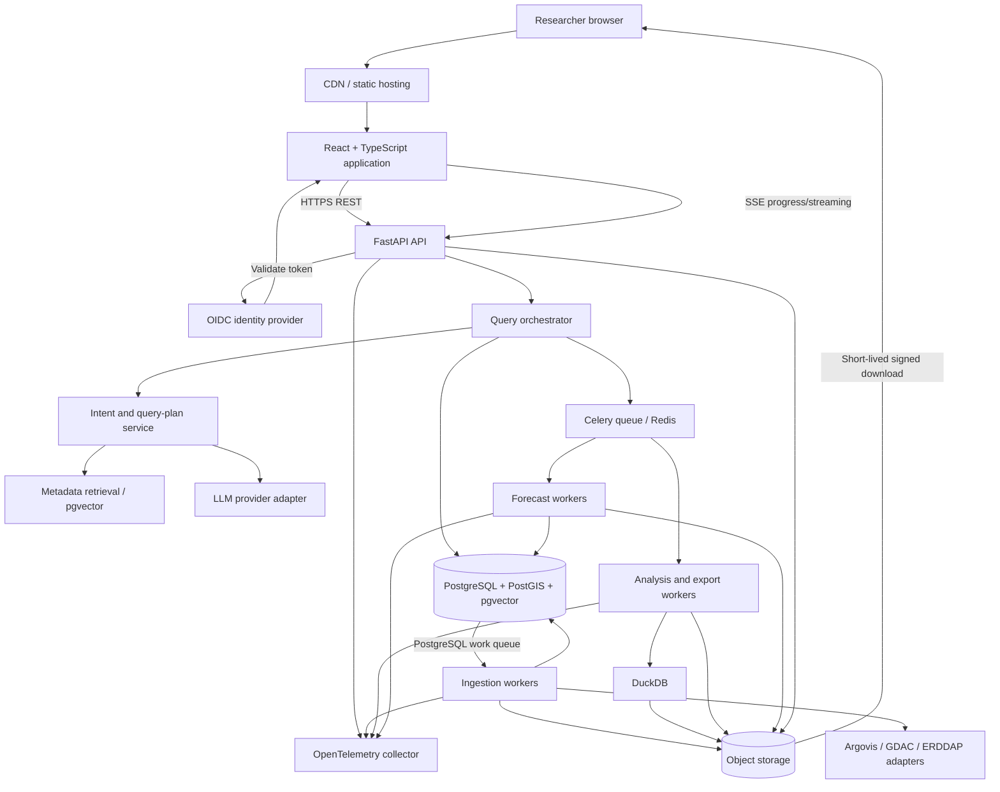

# FloatChat

FloatChat is a research workspace for exploring Argo ocean observations through a conversational interface. This repository is being rebuilt from a hackathon prototype into a Python/React monorepo. Stage 0 provides local infrastructure and a tested scaffold; scientific ingestion, query features, and LLM integration belong to later stages.

**Status: under construction. Stage 1 (Argovis ingestion, Jan-Mar 2025 Indian Ocean acceptance) and Stage 2 (query engine and API) are accepted and merged; Stage 3 (web dashboard) is in progress on `codex/stage-3`.**

## Local development

Required cloud infrastructure cost: **zero**. PostgreSQL/PostGIS/pgvector, Redis, MinIO, FastAPI, and React/Vite run locally in Docker. Stage 1 ingestion workers claim work from a PostgreSQL queue instead of Celery (stage1-v4, ADR-0047); Redis remains for the API. Startup and tests require no LLM calls, Argovis access, production credentials, or cloud services.

The supported development environment is WSL2 Ubuntu 24.04 with Docker Desktop's Linux engine and WSL integration. Docker/WSL installation is a prerequisite. Use a separate checkout on the WSL Linux filesystem; do not move or rewrite the preserved dirty Windows checkout. Windows Docker acceptance and the complete Ubuntu Make verification passed. The fresh merged-main clone also passed the full CI-equivalent suite; see the gate report.

Prerequisites: Git, GNU Make, Python 3.12.12, uv 0.10.4, Node 24.15.0, pnpm 10.33.0, OpenSSL 3.x CLI for ephemeral localhost TLS regression certificates, and Docker Desktop with Compose v2 supporting `--wait` and successful initialization dependencies. Container bases are pinned by digest in `infra/images.json`; upstream source archives are checksum-pinned. The MinIO server/client build from source and require no account or license purchase. First builds download public dependencies and can take up to 20 minutes; service startup is measured separately.

Create a fresh clone on the Linux filesystem, then run from its root:

```bash
git clone https://github.com/Proxpekt/FloatChat.git ~/FloatChat
cd ~/FloatChat
```

Open Ubuntu with `wsl -d Ubuntu-24.04`, install the pinned prerequisite tools, and use a fresh Linux-filesystem clone. For the corrections awaiting review, check out `codex/stage-0-review-fixes`. From the repository root:

```bash
python3 scripts/security/install_gitleaks.py
make setup
pnpm --filter @floatchat/web exec playwright install --with-deps chromium
make dev
```

Open http://127.0.0.1:5173. API health endpoints are http://127.0.0.1:8000/v1/health/live and http://127.0.0.1:8000/v1/health/ready.

### Stage 2 query API

The API documents itself at http://127.0.0.1:8000/docs (OpenAPI at `/openapi.json`, committed as
`apps/api/openapi.json`; the TypeScript client in `apps/web/src/api/` is generated from it with
`pnpm --filter @floatchat/web generate:api`). Endpoints: `GET /v1/catalog/parameters`,
`GET /v1/catalog/coverage`, `GET /v1/floats`, `GET /v1/floats/{platform_number}`,
`GET /v1/profiles`, `GET /v1/profiles/{profile_id}` and `POST /v1/query`, which takes one
validated `stage2-plan-v1` document and compiles it to parameterised PostgreSQL or bounded DuckDB
(no raw SQL anywhere; see [docs/stage2-plan.md](docs/stage2-plan.md) and
[docs/stage2-query-engine.md](docs/stage2-query-engine.md)). The API reads through the
`floatchat_query` login (SELECT on the `app.query_*` views only, statement timeout).

A fresh dev stack holds no science. The accepted Jan-Mar 2025 data of the preserved acceptance
session is copied in with (ADR-0059; the session is started read-only and stopped again):

```bash
uv run --all-packages --frozen python scripts/stage2_dataset.py import --session 302412131a7c99fb
```

Named regions (Arabian Sea, Bay of Bengal, Laccadive Sea, Andaman Sea, Indian Ocean (IHO)) come
from Flanders Marine Institute (2018), IHO Sea Areas, version 3, https://www.marineregions.org/,
https://doi.org/10.14284/323 (CC-BY 4.0), simplified and recorded per ADR-0060.

The original Windows checkout is preserved with its old Git objects. Its push URL is disabled to prevent contaminated-history publication. Use a fresh Linux clone for development; do not merge its ancestry or push it.

`make dev` creates missing development configuration in an access-restricted directory **outside the checkout**, runs ordered migrations and private bucket/application-policy initialization, and waits for health. Linux defaults to `~/.local/state/FloatChat/development`; Windows tooling defaults to `%LOCALAPPDATA%/FloatChat/development`. Set `FLOATCHAT_CONFIG_DIR` to another protected, non-synced directory. Existing configuration is never overwritten. `.env.example` documents every application variable. Edit the generated `.env` to configure `DATABASE_URL`, `REDIS_URL`, and object-storage settings; defaults point to local containers. Do not place administrative credentials in the API, worker, or browser configuration.

```bash
make test
make lint
make typecheck
make integration
make secrets-current
make secrets-history
make stop
```

`make stop` preserves volumes. `make restart` restarts application services. There is no ordinary reset/volume-deletion command. Integration uses a unique project and unused loopback ports, stops that project afterward, and retains its volumes. It never interrupts the normal development project. Restricted configuration and diagnostic logs are retained outside Git alongside those volumes. The reports identify retained test projects for later owner-controlled cleanup.

Empty-volume startup must finish within 300 seconds after builds; subsequent startup must finish within 120 seconds. Readiness returns a sanitized `503` within five seconds when a required dependency is unavailable. Liveness remains `200` while the API process runs. Database and Redis have no published ports; API and web bind to loopback only. The application bucket is private.

### Stage 3 web dashboard

The React dashboard (Vite, React Router, TanStack Query, MapLibre GL, Plotly) runs at
http://127.0.0.1:5173 against the local API: `/dashboard` (coverage panel, profile map, time
series and distribution charts), `/explore/map` (clustered profile locations, float trajectories,
the region bounding box, a profile list as the keyboard path) and `/explore/profiles` (profile
list, temperature and salinity against pressure, temperature-salinity diagrams). Every filter
lives in the URL, for example:

```text
http://127.0.0.1:5173/dashboard?region=Arabian%20Sea&start=2025-01-01&end=2025-02-01&depth_min=0&depth_max=100&qc=science_ready
```

Every result shows its PRD §17 provenance; every chart has a table view and units on its axes;
the basemap is a bundled Natural Earth land layer (no tile server, nothing fetched from the
network; see ADR-0062). The other PRD §14.1 routes are stubs naming the stage that delivers
them. Design and decisions: [docs/stage3-plan.md](docs/stage3-plan.md), ADR-0061 to ADR-0065.

Screenshots of the acceptance run on the imported Jan-Mar 2025 dataset are under
`reports/stage3-acceptance-<date>/` with the report `reports/stage3-acceptance-<date>.json`
(`scripts/stage3_acceptance.py`). The end-to-end scenario (`apps/web/e2e/dashboard.spec.ts`)
runs in CI against the Docker stack seeded by `scripts/science_seed.py` (ADR-0063).

## Security gate

Current-file scanning, staged-index scanning, and full reachable-history scanning are separate. The hook scans the actual Git index, not just working copies. Generated dependencies are excluded; prototype, legacy code, fixtures, and local configuration are not exempt from source scanning. All displayed finding values are fully redacted. Scanner reports and replacement mappings must remain outside Git, build contexts, shared logs, and CI artifacts.

Seven affected remote branches have been sanitized and published using a tested isolated rewrite. The preserved original Windows checkout and backups still contain contaminated historical objects and must never be pushed. See [remediation preparation](docs/history-remediation.md), [execution contract](docs/stage0-contract.md), and [gate report](docs/stage0-gate.md). Local scanner success is evidence for the recorded rules/ref scope; it is not a universal guarantee that every secret has been found.

GitHub workflows define the required Stage 0 checks; their executed results are recorded in the gate report. They use no production services. Required check names are `python`, `web`, `docker`, `integration`, `secrets-current`, and `secrets-history`. Main protection requires all six checks from GitHub Actions with strict up-to-date branches, retains two reviews, enforces administrators, and prohibits force pushes and deletions. Executed passing PR/main runs are linked in the gate report. CI must remain within a free entitlement; do not enable billable runners or paid services. The checks run against sanitized history. Old-clone recovery instructions are in the remediation document.

## Prototype fixture and attribution

`tests/fixtures/profiles.parquet` contains the first 128 physical rows of the preserved January 2025 prototype snapshot. Its manifest records schema, sampling, source checksum, output checksum, byte count, and attribution. It is less than 1,000,000 bytes. Retrieval time and a monthly GDAC snapshot identifier were not recorded by the prototype and are not invented.

```bash
uv run --all-packages --frozen python scripts/sample_fixture.py /path/to/preserved/prototype.parquet
```

The optional `scripts/refetch_prototype.py` downloads an owner-provided HTTPS snapshot with a required checksum, byte bound, timeout, and atomic publication. It does not implement an Argovis adapter. A durable approved source URL is pending; normal startup and tests use the committed fixture. Production ingestion starts in Stage 1.

Argo data are provided freely by the International Argo Program and participating national programs, within the Global Ocean Observing System. Dataset: Argo (2000), *Argo float data and metadata from Global Data Assembly Centre (Argo GDAC)*, SEANOE, [DOI 10.17882/42182](https://doi.org/10.17882/42182). Follow the [Argo acknowledgement guidance](https://argo.ucsd.edu/data/acknowledging-argo/).

Prototype access used Argovis. Reference: Tucker, Giglio, Scanderbeg, and Shen (2020), *Argovis: A Web Application for Fast Delivery, Visualization, and Analysis of Argo Data*, [DOI 10.1175/JTECH-D-19-0041.1](https://doi.org/10.1175/JTECH-D-19-0041.1).

## Target architecture

The following PRD section 4 diagram is the **target architecture**, not a statement of implemented features.


